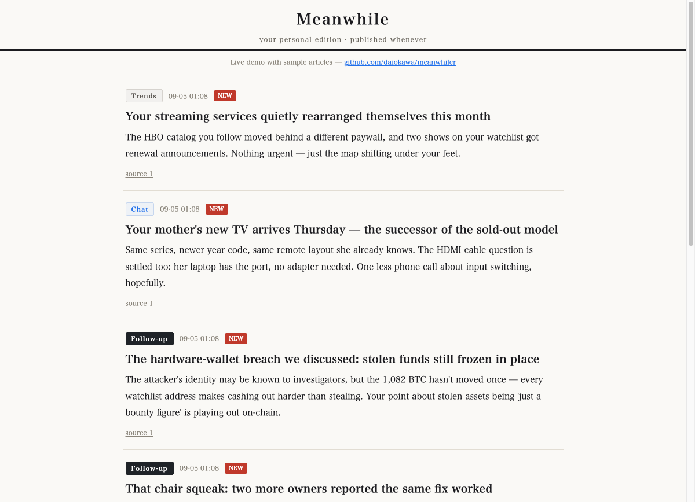

# meanwhiler

**[▶ Live demo](https://ahillchan.com/meanwhiler)** — scroll a sample edition.

*Meanwhile...* — while you were living your life, your topics kept moving. **meanwhiler** is a personal AI newspaper: your own Claude tracks the threads of your conversations and quietly publishes follow-ups to a local page. Like the narrator who says "Meanwhile..." — it watches the scenes you aren't in.

- **No cookies. No tracking. Everything stays local.** Your AI reads *your* conversations on *your* machine; nothing leaves it
- Articles are written by your Claude, in whatever language you talk to it
- Notifications only for genuine "oh!?" moments (3/day max, silence is the default)
- The paper's taste is trained by you: react, and it records what 粋 (iki) means to you

## Requirements
- A machine running Claude Code (Max plan recommended)
- Python 3 (standard library only, zero dependencies)
- Works on macOS, Linux, and Windows (via the Git Bash environment that ships with Claude Code; `post.sh` auto-detects `python3`/`python`). Desktop notifications are OS-specific — ask your Claude to pick a mechanism for your OS (macOS: terminal-notifier, Windows: PowerShell toast, Linux: notify-send)

## Setup
1. Clone this repo, copy `config.example.json` → `config.json` (set your own paper title!)
2. `python3 server/app.py` → your paper is at http://localhost:8770
3. Ask your Claude to read `skills/editorial-procedure.md` and set up its own patrol cron
4. Copy `skills/taste.example.md` → `taste.md`; your Claude builds `topics.md` from your conversations

## Rating what you read (1–10)
Every article has a 1–10 rating strip under it. **6 and above submits in one tap; 5 and below opens a one-line "what fell flat?" box** — because a reason is only needed when something misses.

Run `python3 server/digest.py` to fold `ratings.jsonl` into `server/ratings-digest.md`: per-kind averages, your top 5, your bottom 5 with your notes. The editorial procedure tells your Claude to read it before writing.

One rule is baked into the procedure: **the scores exist to kill the bad, not to copy the good.** An editor that farms high scores starts reaching for whatever worked last time, and the paper goes stale in a new way. Labels are configurable under `rating` in `config.json`.

## Not repeating yourself
`post.sh` refuses to publish when a headline shares proper nouns with anything from the last 30 days, and prints the earlier headlines instead. Genuinely new development? Rewrite the body to cover only the delta and pass `--dup-ok` as the 5th argument.

It cannot tell "3rd branch opens" from "apprentice leaves to open his own place" — it only sees shared names. **Deciding whether it is the same event is the editor's job**; the guard just makes sure the editor looks.

## Naming your paper
The tool is meanwhiler; **the paper is yours to name** (`paper_title` in config.json). The default Japanese example is 「続報と雑談」 ("follow-ups and idle talk").

## Ads (optional, off by default)
If `ad_feed_url` is set, your AI fetches a static ad feed (identical for all readers — your profile never leaves your machine) and may include **at most one ad per day, only if it genuinely fits your context**, always disclosed in the body text. Leave `ad_feed_url` empty for zero ads. Details: `ads/ADS.md`.

---

日本語のセットアップ手順は docs/README.ja.md を参照してください。
